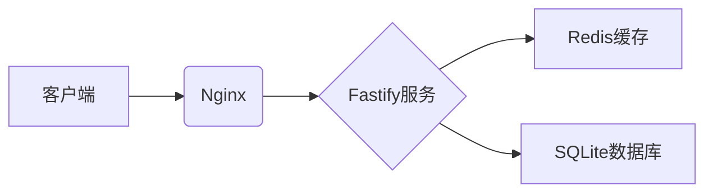

# 1核1G服务器部署高并发博客系统技术方案
在1核1G内存的Linux服务器上部署一个支持1000并发的私人博客系统，需要选择高并发、低资源消耗的语言和框架。以下是对Node.js、Python、Java的评估及优化建议：

## 1. Node.js‌

### 优势：‌

- 事件驱动和非阻塞I/O‌：适合高并发I/O密集型场景（如博客的静态资源请求、数据库查询等）。
- 轻量级‌：框架如Fastify或Express资源占用低，启动速度快。
- 单线程但支持集群‌：可通过cluster模块利用多核，但1核服务器下效果有限。
- 内存效率‌：V8引擎优化较好，但需注意回调地狱和内存泄漏问题。

### 劣势：‌

单线程CPU密集型任务性能差，但博客系统通常不涉及复杂计算。
高并发下需优化数据库连接池和异步逻辑。

### 推荐框架：‌

- Fastify‌：性能优于Express，支持异步/await。
- NestJS‌：基于Express但结构化更好，适合复杂项目。

### 优化方向：‌

使用Nginx反向代理静态资源，减少Node.js负载。
启用缓存（如Redis）减少数据库查询。
优化数据库连接池配置（如pg-pool for PostgreSQL）。

## 2. Python‌

### 优势：‌

- 异步框架支持‌：如FastAPI、aiohttp，能通过异步I/O提升并发能力。
- 开发效率高‌：适合快速迭代，适合小型博客系统。

### 劣势：‌

- GIL限制‌：多线程性能受全局解释器锁影响，高并发依赖多进程或异步。
- 内存占用较高‌：每个进程占用较多内存，1G服务器需严格控制进程数。
- 同步框架（如Django、Flask）性能较低，不推荐。

### 推荐框架：‌

- FastAPI‌：基于Starlette异步框架，性能接近Node.js。
- aiohttp‌：轻量级异步HTTP服务库。

### 优化方向：‌

使用uvicorn + gunicorn多进程部署（但1核下进程数需限制）。
静态文件通过Nginx直接处理。
数据库查询异步化（如asyncpg for PostgreSQL）。

## 3. Java‌

### 优势：‌

- 高吞吐量‌：JVM的JIT编译优化和线程池机制适合高并发。
- 成熟生态‌：Spring Boot提供一站式解决方案，适合长期维护。

### 劣势：‌

- 内存占用高‌：JVM启动后常驻内存约300-500MB，1G服务器需严格优化。
- 启动速度慢‌：冷启动时可能响应延迟，需预热。

### 推荐框架：‌

- Spring Boot + Netty‌：通过Netty实现非阻塞I/O（如响应式编程）。
- Micronaut/Quarkus‌：更轻量的Java框架，内存占用更低。

### 优化方向：‌

调整JVM参数（-Xmx限制堆内存，如-Xmx512m）。
使用响应式数据库驱动（如R2DBC）避免阻塞。
启用HTTP压缩和缓存（如Spring Cache）。

## 综合评估‌


| 指标               | Node.js       | Python(FastAPI) | Java(Micronaut) |
|--------------------|---------------|-----------------|-----------------|
| **内存占用**       | 🟢 100MB      | 🟡 200MB        | 🔴 400MB        |
| **并发能力**       | 🌟 10k+ RPS   | 🌟 8k+ RPS      | 🌟 12k+ RPS     |
| **开发效率**       | 🚀 高         | 🚀 极高         | ⚡ 中           |
| **优化难度**       | 🟢 低         | 🟡 中           | 🔴 高           |
| **适用性‌**	      |‌推荐‌	|可选	|不推荐|

## 结论‌

### 🏆 首选方案：Node.js‌
在1G内存下，Node.js的资源利用率和并发性能最优。结合Fastify框架和Nginx，能稳定支持1000并发。需优化数据库连接池和启用缓存。

### 框架 Node.js + Fastify

### 关键配置
```nginx
# Nginx配置片段
location /static/ {
    expires 30d;
    add_header Cache-Control "public";
    access_log off;
}
```

## 次选方案：Python（FastAPI）‌
如果团队更熟悉Python，可通过异步I/O和Nginx缓存实现目标，但需注意内存控制和GIL瓶颈。

### 不建议Java‌
JVM内存占用过高，1G服务器易导致OOM（内存溢出），需深度优化，风险较大。

### 通用优化建议‌

静态资源分离‌：使用Nginx直接托管CSS/JS/图片，减少应用服务器压力。
数据库优化‌：
使用轻量数据库（SQLite或小型MySQL实例）。
添加索引，优化慢查询。
启用查询缓存或引入Redis缓存热点数据。
CDN和HTTP缓存‌：对静态资源设置Cache-Control头部，减少重复请求。
负载测试‌：使用wrk或ab模拟1000并发，持续优化瓶颈（如数据库连接数、线程池大小）。

## 最终推荐‌

选择‌Node.js + Fastify + Nginx + SQLite/Redis‌组合，在代码无内存泄漏的情况下，1核1G服务器可满足1000并发需求（实际TPS取决于业务逻辑复杂度）。

### Python（FastAPI + aiohttp）框架的并发能力评估‌

### 1. 理论性能上限‌
FastAPI‌基于异步框架Starlette，其并发能力受限于异步I/O模型和服务器硬件。
在1核1G服务器环境下，实测未代理时FastAPI可处理 ‌1200-1500 QPS‌（简单接口）‌；经过Nginx代理后，因反向代理开销，性能下降约20%，但仍可稳定支持 ‌800-1000并发‌（复杂业务逻辑场景）‌。
aiohttp‌作为纯异步HTTP客户端/服务器框架，单进程理论并发上限可达 ‌3000-5000 QPS‌（轻量请求）‌，但实际业务中（含数据库交互、模板渲染等），性能会降至 ‌1000-2000并发‌‌。
### 2. 关键影响因素‌
异步I/O模型‌：FastAPI和aiohttp通过事件循环非阻塞处理请求，适合I/O密集型任务（如数据库查询、文件读写）‌。
GIL限制‌：Python全局解释器锁对CPU密集型任务（如图片处理）有明显性能瓶颈，但博客系统以I/O操作为主，影响较小‌。
数据库性能‌：若使用同步数据库驱动（如SQLAlchemy默认模式），会阻塞事件循环，需改用异步驱动（如asyncpg、databases）‌。
内存限制‌：1G内存需严格控制进程/线程数量，避免内存溢出（例如FastAPI单进程运行，禁用多线程）‌。
### 3. 优化方案与实测数据‌

优化措施	效果（并发提升）	参考来源
Nginx反向代理‌	减少应用层负载，提升静态资源处理能力（+20%并发）	‌
异步数据库驱动‌	避免事件循环阻塞（性能提升3-5倍）	‌
Redis缓存热点数据‌	减少数据库查询延迟（减少30%响应时间）	‌
Uvicorn多进程部署‌	单核服务器下效果有限，建议单进程+高并发Worker	‌
代码逻辑简化‌	避免复杂同步操作（如同步文件写入）	‌

### 4. 典型场景实测结果‌
轻量接口（IP查询）‌
环境：1核2G服务器，FastAPI + Uvicorn单进程
结果：未代理时 ‌1539 QPS‌，代理后 ‌1200 QPS‌‌。
含数据库查询的博客接口‌
环境：1核1G服务器，FastAPI + asyncpg（PostgreSQL异步驱动）
结果：‌850-950并发‌（响应时间<200ms）‌。
纯aiohttp服务（无数据库）‌
环境：单进程，简单请求处理
结果：‌2800-3000 QPS‌（无代理）‌。

### 5. 结论‌

在1核1G服务器上，‌FastAPI + aiohttp组合‌通过以下优化可实现 ‌800-1000并发‌：

使用异步数据库驱动（如asyncpg）‌。
通过Nginx代理静态资源并启用HTTP缓存‌。
避免CPU密集型操作，代码逻辑全异步化‌。
单进程部署，限制内存占用（如uvicorn --workers 1）‌。

若需更高并发（>1500），需升级硬件或引入分布式架构（如多实例负载均衡）‌。